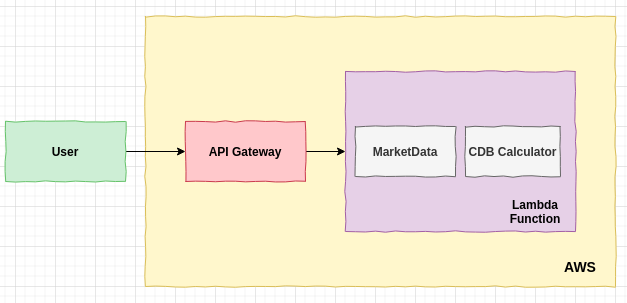

# Who am I

A scalable service to get the CDI Unit Prices between two dates.

# Architecture Diagram



# Setup

## Install dependecies

```bash
npm install
```

## Run tests

```bash
npm test
```

## Run local

```bash
npm start
```

## Run on Docker

```bash
bash docker.sh start
```

## Run on AWS Prod Environment

```bash
# config your AWS credentials running `aws configure`
npm run start:prod
```
